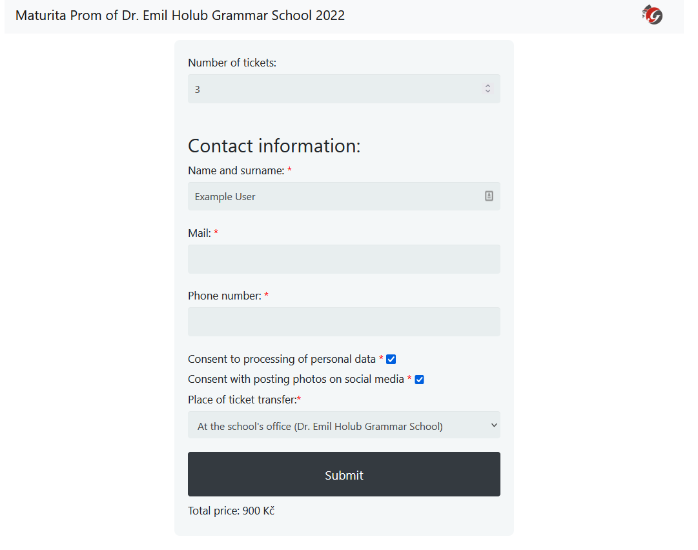

# Ticket booking website
This is an English version of a website I used for booking tickets for our school prom. It is still available on [PythonAnywhere](http://kozakstanda23.eu.pythonanywhere.com/).
### Functionality
The webpage enables users to enter their contact information and book desired tickets they've chosen from a map. They get assigned an ID they will use for payment. Their data is saved to database and they receive a confirmation mail. After payment, they receive their tickets at the school's office or from other students.
### Administration
People who give out the tickets can view the user's information on the [administration page](kozakstanda23.eu.pythonanywhere.com/administration) after entering username and password (you can use *"office"* as username and blank password). They can find users by their ID and view whether they paid or not (or set this information manually).\
Administrator (username *"administration"*) can click a button to automatically check the payments and cancel bookings that were not paid for in time.
### Screenshots

  <figcaption>Form for booking tickets for standing.</figcaption>
</figure>
<figure>
  
  <figcaption>Choose seats at tables (you can access this page without having to enter contact information <a href="http://kozakstanda23.eu.pythonanywhere.com/show_table_map">here</a>).</figcaption>
</figure>
<figure>
  
  <figcaption>Administration page for people giving out the tickets (username "office").</figcaption>
</figure>